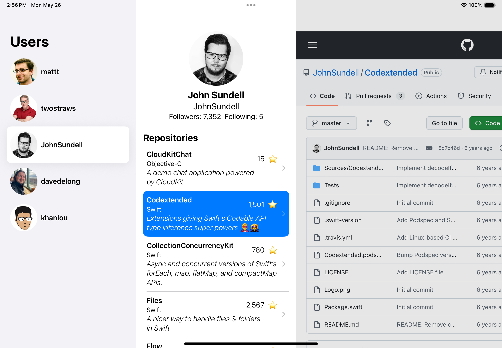

# GithubApp

A SwiftUI app that displays a list of GitHub users, their details, and their non-forked repositories. Selecting a repository shows it in an embedded WebView.




---

## ✨ Features

- Browse a predefined list of GitHub usernames
- View user profiles with avatar, follower/following counts, and full name
- Display non-forked repositories with name, language, stars, and description
- Tap to open a repository in an embedded WebView

---

## 🚀 Getting Started

### 🛠 Setup

🔐 GitHub Access Token Setup

GitHub’s unauthenticated API requests are rate-limited to 60 requests/hour.
To raise the limit and avoid 403 errors, you can add a Personal Access Token (PAT) with no scopes required.

Add a Secrets File
1.  Copy the example file:

```bash
cp Secrets.plist.example Secrets.plist
```

2.  Open Secrets.plist in Xcode or any text editor and insert your token:
```xml
<?xml version="1.0" encoding="UTF-8"?>
<!DOCTYPE plist PUBLIC "-//Apple//DTD PLIST 1.0//EN"
 "http://www.apple.com/DTDs/PropertyList-1.0.dtd">
<plist version="1.0">
<dict>
    <key>GITHUB_TOKEN</key>
    <string>your_personal_access_token_here</string>
</dict>
</plist>
```

The app will automatically read this token at runtime and attach it to authenticated API requests.
